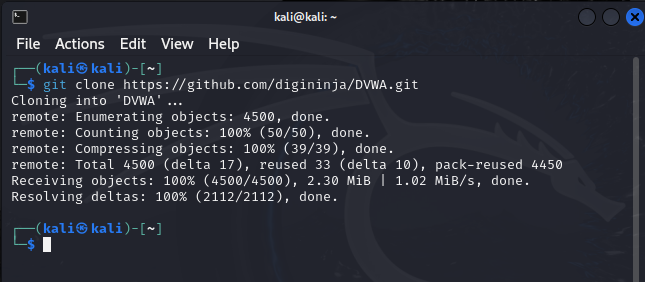
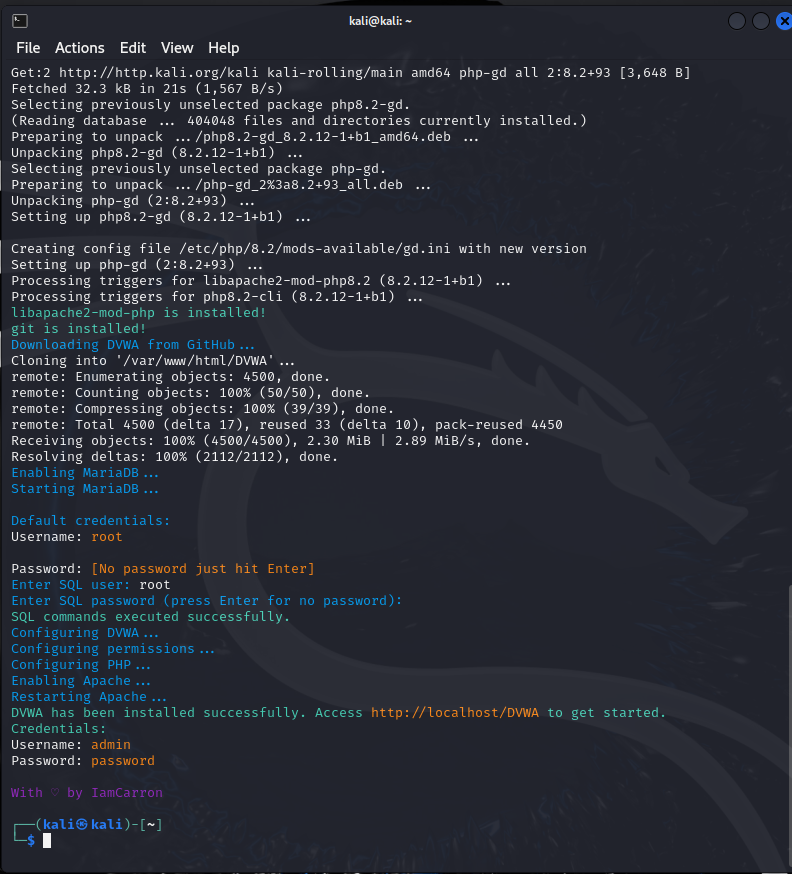
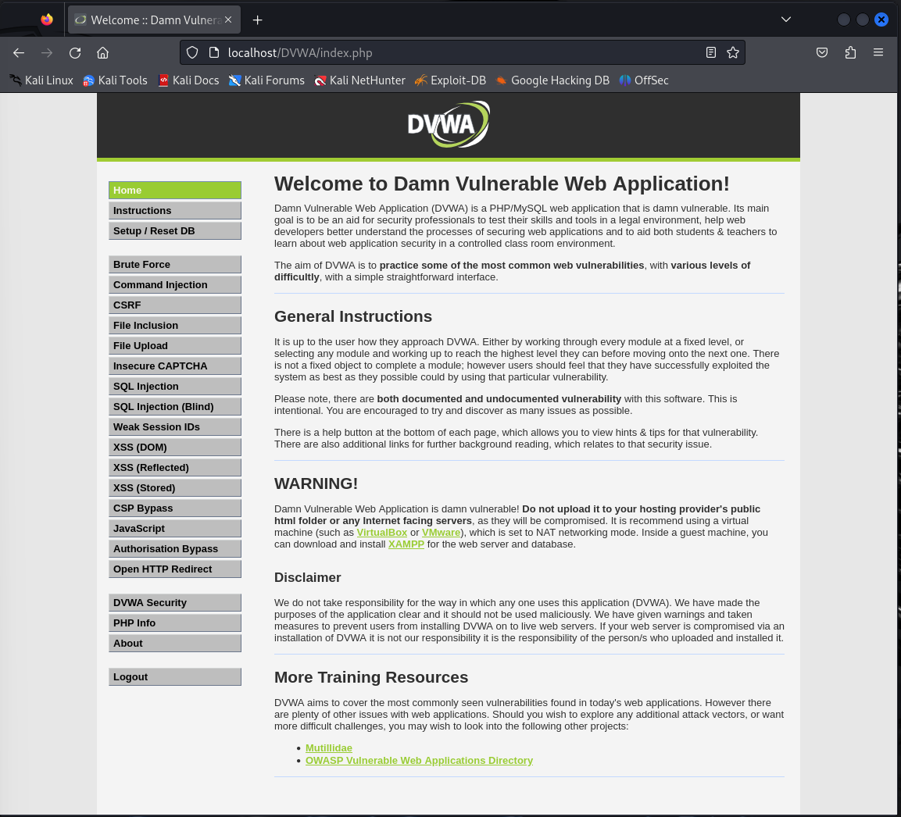

---
## Front matter
lang: ru-RU
title: Индивидуальный проект №2
subtitle: Дисциплина "Информационная безопасность"
author: Боровиков Даниил Александрович
  - 
institute:
  - Российский университет дружбы народов, Москва, Россия

## i18n babel
babel-lang: russian
babel-otherlangs: english

## Formatting pdf
toc: false
toc-title: Содержание
slide_level: 2
aspectratio: 169
section-titles: true
theme: metropolis
header-includes:
 - \metroset{progressbar=frametitle,sectionpage=progressbar,numbering=fraction}
 - '\makeatletter'
 - '\beamer@ignorenonframefalse'
 - '\makeatother'
---

# Вводная часть

## Цели и задачи

- Установить DVWA в гостевую систему к Kali Linux и проверить его работу.

## Теоретическое введение

DVWA (или проклятый уязвимый веб-сервер) - это веб-приложение на PHP/MySQL, основная цель которого - стать помощником для профессионалов в области безопасности.

## Клонируем репозиторий github

{ #fig:001 width=50% }

## Получаем ссылку на сайт и пароль с логином и переходим по ней

{ #fig:002 width=50% }

## Создание базы данных

{ #fig:003 width=50% }

# Результаты

- Выполнены все необходимые действия.

## Вывод

В ходе индивидуального проекта мы установили DVWA в гостевую систему к Kali Linux и проверили его работу.
