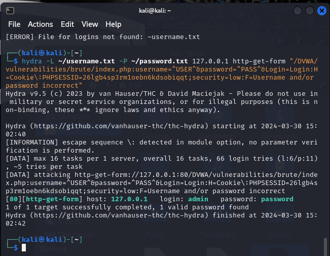
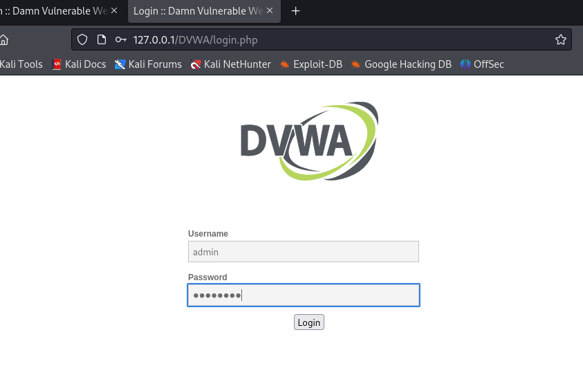
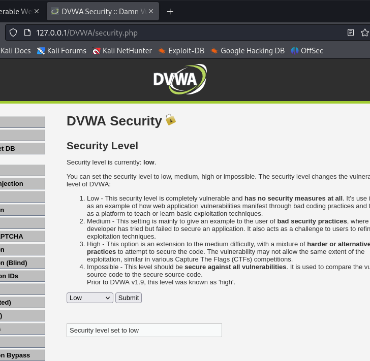
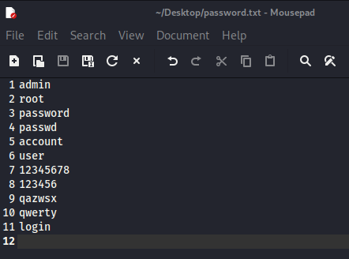
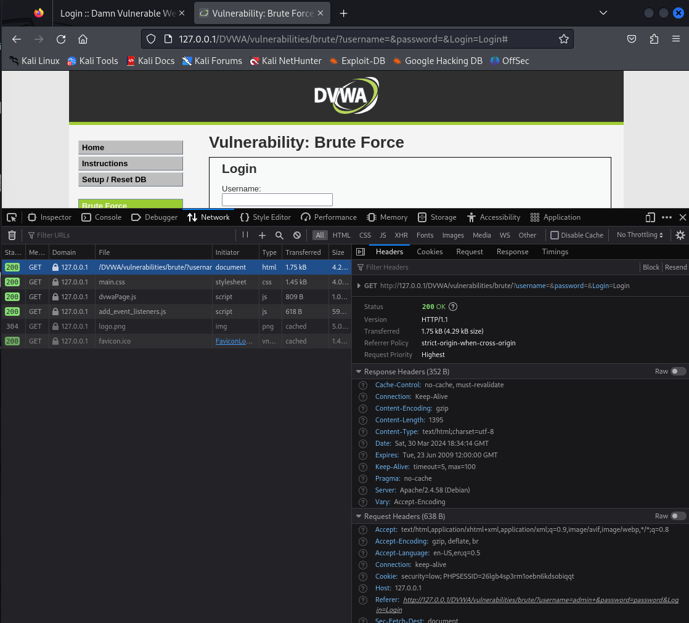
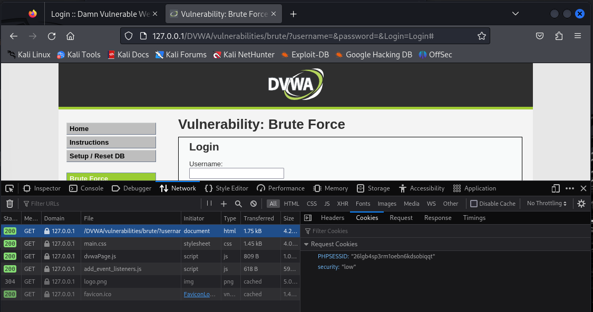
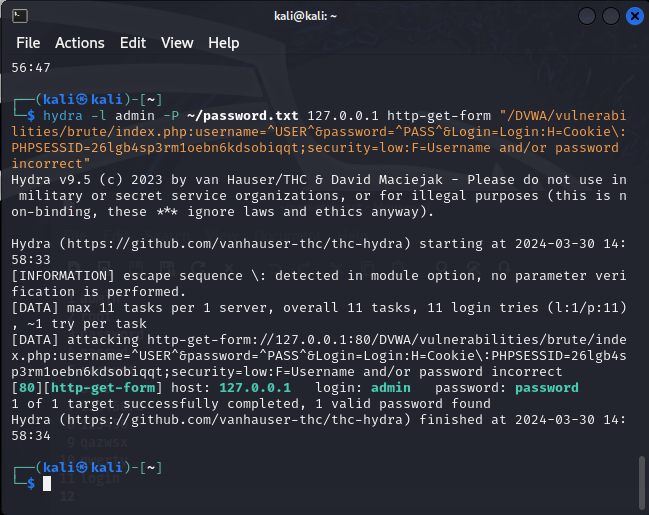

---
## Front matter
lang: ru-RU
title: Индивидуальный проект №3
subtitle: Основы информационной безопасности
author:
	Боровиков Данииил Александрович
institute:
  - Российский университет дружбы народов им. Патриса Лумумбы, Москва, Россия

## i18n babel
babel-lang: russian
babel-otherlangs: english

## Formatting pdf
toc: false
toc-title: Содержание
slide_level: 2
aspectratio: 169
section-titles: true
theme: metropolis
header-includes:
 - \metroset{progressbar=frametitle,sectionpage=progressbar,numbering=fraction}
 - '\makeatletter'
 - '\beamer@ignorenonframefalse'
 - '\makeatother'

## Fonts
mainfont: Arial
romanfont: Arial
sansfont: Arial
monofont: Arial
---

## Цели и задачи

Знакомство с Hydra для подбора или взлома имени пользователя и пароля.

# Выполнение лабораторной работы

## Открываю в браузере страницу http://127.0.0.1/DVWA/login.php и вхожу в DVWA

{ #fig:001 width=70% }

## Открываю страницу http://127.0.0.1/DVWA/security.php и выставляю уровень безопасности на низкий

{ #fig:002 width=70% }

## Создаю файл с паролями, в него ввожу самые распространенные пароли 

{ #fig:003 width=70% }

## Перехожу во вкладку Brute Force, где можно подобрать комбинацию логина и пароля и проверить, верна ли она. Во вкладке Network консоли разработчика смотрю запрос для валидации логина и пароля - это GET-запрос, отправляющий логин, пароль в качестве параметров 

{ #fig:004 width=70% }

## Куки GET-запроса - уровень безопасности и id сессии 

{ #fig:005 width=70% }

## Ввожу команду для hydra:

hydra -l admin -P ~/passwords.txt 127.0.0.1 http-get-form "/DVWA/vulnerabilities/brute/:username=^USER^&password=^PASS^&Login=Login:H=Cookie\:PHPSESSID=1pu2bih9masffp4i16iap5dglc;security=low:F=Username and/or password incorrect"

ключ -l –	логин для входа
ключ -P –	пароль для входа, берутся все возможные из файла ~/passwords.txt
http-get-form – тип запроса (GET)
дополнительный параметр (длинная строка) - полный путь, параметры, куки, и сообщение при ошибке

## В результате, hydra подобрала верную комбинацию: логин admin и пароль password

{ #fig:006 width=70% }

## Создаю файл с возможными логинами

{ #fig:007 width=70% }

## Изменяю команду для hydra: указываю ключ -L ~/usernames.txt, чтобы логины ткаже перебирались из файла 

hydra -L ~/usernames.txt -P ~/passwords.txt 127.0.0.1 http-get-form "/DVWA/vulnerabilities/brute/:username=^USER^&password=^PASS^&Login=Login:H=Cookie\:PHPSESSID=1pu2bih9masffp4i16iap5dglc;security=low:F=Username and/or password incorrect"

## Измененная команда

{ #fig:008 width=70% }

## Вывод

Я познакомился с hydra, научился подбирать логины и пароли с помощью нее, отправляя запросы.
