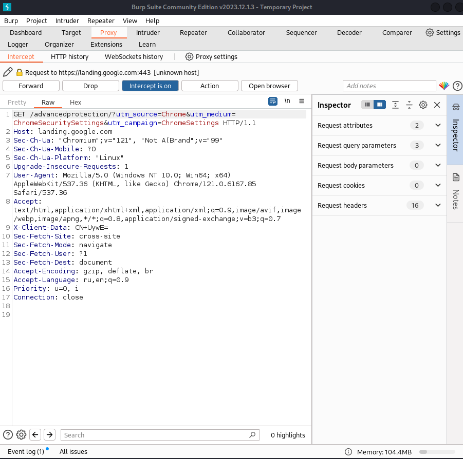
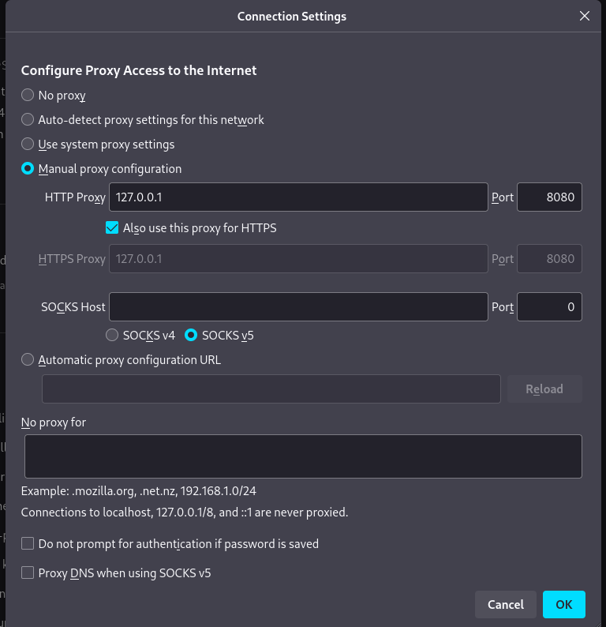
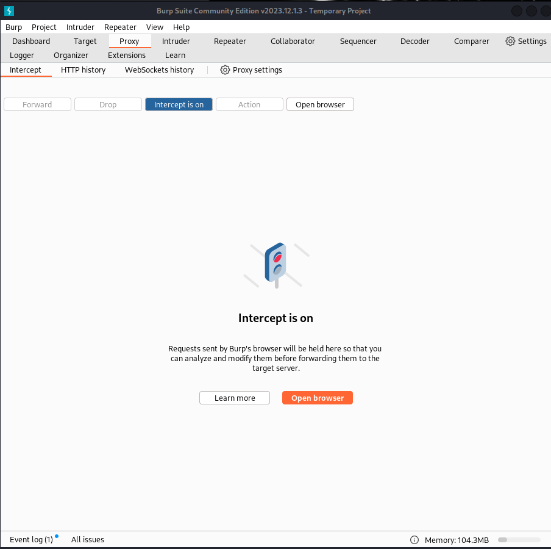

---
## Front matter
lang: ru-RU
title: Индивидуальный проект №5
author: Боровиков Даниил Александрович
institute: Российский Университет Дружбы Народов
date: 27 апреля, 2024, Москва, Россия

## Formatting
mainfont: PT Serif
romanfont: PT Serif
sansfont: PT Sans
monofont: PT Mono
toc: false
slide_level: 2
theme: metropolis
header-includes: 
 - \metroset{progressbar=frametitle,sectionpage=progressbar,numbering=fraction}
 - '\makeatletter'
 - '\beamer@ignorenonframefalse'
 - '\makeatother'
aspectratio: 43
section-titles: true

---

# Вводная часть

## Цели и задачи

Знакомство с программой Burp Suite и изучение ее функционала.

# Выполнение лабораторной работы

## Открываю Burp Suite и во вкладке Proxy включаю перехват http-запросов

{ #fig:001 width=60% }

## В настройках браузера настраиваю прокси-сервер

{ #fig:002 width=60% }

## Теперь, трафик браузера перехватывается в программе Burp Suite. Например, при открытии веб-страницы мы видим GET-запрос к ней

{ #fig:003 width=60% }

## Вывод

Я познакомился с Burp SUite и научился его применять на практике.
